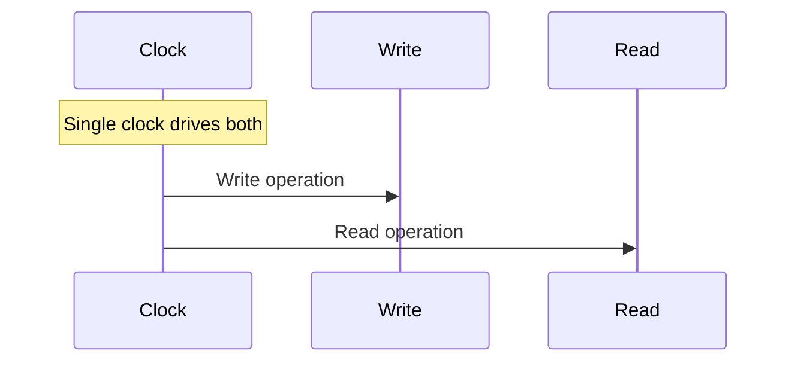
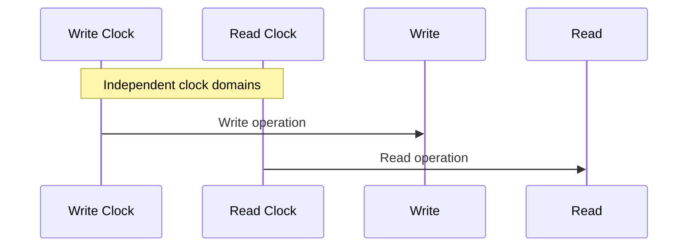

# FIFO, Synchronous FIFO, and Asynchronous FIFO

## 📌 Introduction

**FIFO** (*First-In, First-Out*) is a data structure/buffer where the first data element written is the first one to be read. This ordering is important in digital systems to preserve sequence of operations.

---

## 🔹 Synchronous FIFO

A **Synchronous FIFO** uses a **single clock** for both read and write operations.

* Simple design.
* No clock domain crossing issues.
* Best for systems where producer and consumer share the same clock.

### ✅ Applications

* Data buffering in a single clock domain.
* Pipelined architectures.
* Modules operating with the same clock source.

### ⏱️ Diagram

---

## 🔹 Asynchronous FIFO

An **Asynchronous FIFO** uses **different clocks** for write and read operations.

* Requires special techniques (Gray-code pointers, synchronizers) to avoid metastability.
* Ideal for transferring data between independent clock domains.

### ✅ Applications

* Interfacing between different clock domains (e.g., CPU ↔ peripheral).
* Communication between SoC modules at different speeds.
* Handling variable data rates.
* FPGA/ASIC clock domain bridging.

### ⏱️ Diagram

---

## 🖼️ Visual Alt Text

* **Synchronous FIFO**: Both read & write driven by the same clock.
* **Asynchronous FIFO**: Read & write driven by independent, unsynchronized clocks.

---

👉 FIFOs (Sync & Async) are widely used in **digital design, FPGA/ASIC development, and SoC architectures** to ensure safe and efficient data transfer.

---
